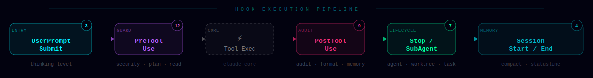

<p align="center">
  
</p>

<p align="center">
  <a href="https://github.com/sergeeey/Claude-cod-top-2026/actions/workflows/ci.yml">
    
  </a>
  &nbsp;
  
  &nbsp;
  
  &nbsp;
  
  &nbsp;
  
  &nbsp;
  
  &nbsp;
  
  &nbsp;
  
</p>

<h2 align="center">Evidence-aware Goal Operating Layer for Claude Code</h2>

<p align="center">
  Give Claude Code a goal. It builds an <b>explainable plan</b>, composes the right
  capabilities, executes within a <b>bounded autonomy budget</b>, <b>verifies</b> the
  result, and <b>remembers</b> what worked.
</p>

<p align="center">
  Other tools make an agent more capable. This one makes more capability
  <b>safe to hand over</b> — by making every result checkable.<br/>
  Trust and evidence aren't the product; they're the <b>control system</b> that lets you
  give the agent more autonomy without more blind faith.
</p>

<h3 align="center">The failure it was built to catch</h3>

<p align="center">
  Agent writes a test.<br/>
  Runs it on synthetic data it just generated.<br/>
  Reports <code>F1=1.000 ✅ SUCCESS</code>.<br/>
  You deploy.<br/>
  <b>Real-world data crashes everything.</b>
</p>

<p align="center">
  This is <b>Validation Theater</b>, and the <b>Verify</b> stage of the loop exists to stop it.<br/>
  Every claim carries an evidence marker —<br/>
  <code>[VERIFIED-REAL]</code> (real data, sources cited) vs <code>[VERIFIED-SYNTHETIC]</code> (mock data, never valid for production claims).<br/>
  Hard rule baked into <code>rules/integrity.md</code>: <b>synthetic ≠ real</b>.
</p>

<p align="center">
  <sub>Backed by 90 hooks · 13 agents + 3 teams · 2266 tests · 80% coverage · MIT · Deploy in 5 min</sub>
</p>

<p align="center">
  <b>📋 No install? Get the rules only:</b><br/>
  <a href="docs/anti-hallucination.md"><code>docs/anti-hallucination.md</code></a> — single file, ~500 tokens, paste into your <code>CLAUDE.md</code>.<br/>
  Catches Validation Theater on its own. Compatible with any Claude Code config.
</p>

---

<p align="center">
  
</p>

---

## What is this?

Claude-cod-top-2026 is an **Evidence-aware Goal Operating Layer for Claude Code.**

Give Claude Code a goal; it turns it into an explainable plan, composes the right
capabilities (skills, agents, tools, memory), executes within a bounded autonomy budget,
verifies the result, and remembers what worked. It does not try to replace memory systems,
skill catalogs, virtual engineering teams, or AI tool managers — it *composes* whichever of
those you use.

**Trust & Evidence** — the evidence gates, oracle checks, validation-theater detection, stop
conditions, and null-result memory — is the mandatory **control system** of that product, not
the whole of it. It is what makes handing the agent more work safe: more capability, made
checkable — not capability withheld.

See [`docs/positioning.md`](docs/positioning.md) for the full comparison and where this
fits alongside tools like memory layers, skill catalogs, and multi-agent frameworks.

**Status, honestly:** conceptually strong, clean-install path fixed and re-verified
(see `install.sh` acceptance checks), dogfood evidence still growing (2 real runs so
far — see `experiments/`). Not a claim of "production-ready" yet.

---

## From Prompting Agents to Auditing Loops

AI development is shifting from one-shot prompts to **recurring agent loops** — agents that run on
a schedule, verify results, and act autonomously. Platforms like
[Langflow](https://github.com/langflow-ai/langflow) make building these loops easy.

The problem: **loops amplify whatever is inside them.** Without evidence gates, a loop that runs
every 30 minutes will report `SUCCESS ✅` every 30 minutes — even when the agent is testing itself
on synthetic data it just generated.

This config adds the audit layer that loop platforms skip:

```
Vanilla loop:    Trigger → Agent → Report SUCCESS → Repeat
Evidence-safe:   Trigger → Agent → Classify evidence → Audit gate → Act or escalate → Repeat
```

| What loops need | This repo provides |
|---|---|
| Evidence classification | `[VERIFIED-REAL]` vs `[VERIFIED-SYNTHETIC]` — hard rule in `rules/integrity.md` |
| Synthetic detection | `hooks/validation_theater_guard.py` catches inline mock data |
| Skeptic auto-trigger | Fires on F1≥0.9, "all passed", round numbers |
| Null result tracking | `null_results/INDEX.md` — dead paths are data, not noise |
| Human escalation | Audit gate flags; human approves; loop continues clean |

> **Don't just prompt agents. Build loops that audit them.**
>
> Full spec and Loop Spec template: [`docs/LOOP_CODING.md`](docs/LOOP_CODING.md)

---

## Oracle-Aware Evolutionary Mode

Auditing a loop tells you whether *a* result is real. The next step is to *search*
for the best result without fooling yourself — and the way you fool yourself is by
optimizing hard against a judge you never audited. A perfect score from a worthless
oracle (`F1=1.000` on synthetic data) is the canonical trap.

`/evolve-solution` runs the **Oracle-Aware Core** — never one solution, always a
field of competing variants, judged by an oracle that earned trust first:

```
Intent → Oracle-Adequacy Gate → Falsification Contract → Variant Tournament
       → Red-Team → Evidence Gate → Null Result Ledger
```

| Stage | Question it answers | Backed by (no new hooks, no new agents) |
|---|---|---|
| **Intent** | What are we really optimizing? | `rules/estimand-ops.md`, `/estimand-bridge` |
| **Oracle Adequacy** | Is the judge worth optimizing against? | [`docs/oracle-adequacy-gate.md`](docs/oracle-adequacy-gate.md), `validation_theater_guard` |
| **Falsification** | What would prove each variant wrong? | `rules/falsification-ladder.md` |
| **Tournament** | Which of ≥3 variants wins? | `/cross-domain`, `/hypothesis-arbiter`, `/combinatorial-creativity` |
| **Red-Team** | Does the winner survive attack? | `/skeptic`, `/codex-skeptic` |
| **Evidence Gate** | Is the win proven, not claimed? | `rules/integrity.md`, `promotion_gate_guard` |
| **Null Ledger** | What did we learn from the dead? | `null_results/`, `reject_gate_guard`, `null_retroscan` |

The genuinely new piece is the **Oracle-Adequacy Gate**: optimizing against an
inadequate oracle is *worse* than not optimizing — it manufactures false confidence
at scale. So the oracle is audited (gameable? negative control? real data?) before
any variant runs.

```
/evolve-solution "find a non-obvious way to cut our RAG hallucination rate"
```

> Command: [`commands/evolve-solution.md`](commands/evolve-solution.md) ·
> Gate: [`docs/oracle-adequacy-gate.md`](docs/oracle-adequacy-gate.md) ·
> Templates: `templates/intent_card.yaml`, `oracle_audit.yaml`, `falsification_contract.yaml`

---

## What This Config Does NOT Do

- Does **not** replace human code review — it adds a second layer, not a substitute
- Does **not** guarantee zero hallucinations — reduces frequency and adds detection
- Works **only** with Claude Code (not Cursor, Codex, VS Code Copilot, Gemini)
- **Not** independently verified beyond a single-developer workflow
- Does **not** come with enterprise SLA or paid support
- Does **not** manage secrets or rotate API keys — use a proper vault

---

## Why This Config?

> **Claude Code без этого конфига** — как Ferrari на ручнике: мощный, но большая часть потенциала не используется.
> **With this config** — коммиты проходят автоматические проверки, агенты помнят контекст между сессиями, повторяющиеся ошибки фиксируются и эскалируются в правило.

Most configs are a single `CLAUDE.md` bloated to 3000+ tokens. This is different:

| | Typical config | **This config** |
|---|---|---|
| **Tokens/msg** | 3 000 – 5 000 | **~500** (core only) |
| **Hallucinations** | "trust me" | Evidence Policy + Confidence Scoring |
| **MCP failures** | session hangs | CircuitBreaker — auto-recovery in 60s |
| **Prompt injection** | no protection | InputGuard — 8 categories, auto-block |
| **PII leakage** | hope for the best | 12 regex patterns + auto-redact |
| **Code review** | optional | review-squad — parallel reviewer + sec-auditor |
| **Permissions** | ask for everything | `permission_policy` PreToolUse hook — auto-allow/deny/ask per Bash command, before the prompt |
| **Agent memory** | stateless | 4 agents with persistent memory across sessions |
| **Tests** | "I'll write them later" | 2266 tests, TDD-first, Test Protection hard rule |

---

## When to Use This vs everything-claude-code

[everything-claude-code](https://github.com/affaan-m/everything-claude-code) is a great alternative — bigger, multi-platform, Anthropic Hackathon Winner. Both are MIT, pick what fits.

**Use [everything-claude-code](https://github.com/affaan-m/everything-claude-code) if:**
- You want **multi-language coverage** (TS, Go, Java, Kotlin, Rust, C++, PHP — 12+ ecosystems)
- You work across **multiple harnesses** (Codex, Cursor, OpenCode, Gemini — not just Claude Code)
- You want a **GUI dashboard** for browsing components
- You like the **paid tier** path (ECC Tools GitHub App, free / pro / enterprise)

**Use this config if:**
- **"Validation Theater" is a $$$ risk for you, not abstract** — Evidence Policy is enforced as hard rule, not just a skill
- You work with **sensitive data** (PII, finance, healthcare) — built-in redaction hook scrubs sensitive strings before any external MCP call
- You need to **read every hook before installing** — only ~10 MB, plain Python, no JS dependencies, every file readable in 10 minutes
- You prefer **Claude Code only with deep specialization** over multi-platform breadth
- You speak **Russian** — README and rules have RU-first sections, useful for CIS dev teams

**Comparison at a glance:**

| | [everything-claude-code](https://github.com/affaan-m/everything-claude-code) | **This config** |
|---|---|---|
| **Surface** | 48 agents · 182 skills · 68 commands · ~31 MB | 13 agents + 3 squads · 125 skills · 90 hooks · ~10 MB |
| **Languages** | TS, Py, Go, Java, Kotlin, Rust, C++, PHP, Perl | Python primarily |
| **Harnesses** | Claude Code, Codex, Cursor, OpenCode, Gemini, Antigravity | Claude Code only |
| **Anti-hallucination** | continuous-learning v2 with confidence scoring | **Evidence Policy + Validation Theater Guard + Audit Verification Gate** (synthetic ≠ real, enforced) |
| **PII / sensitive data** | generic | dedicated redaction hook + local-first (Ollama) |
| **Audit Verification Gate** | not in core | `rules/audit-verification-gate.md` — agent's `[VERIFIED]` = your `[INFERRED]` |
| **Recurring mistake tracking** | instinct-based | `[×N]` counter — after 3 occurrences a mistake becomes a hard rule |
| **License** | MIT (open core, paid GitHub App) | MIT (no paid tier) |

If multi-language / cross-harness matters more than anti-hallucination focus — pick ECC. If anti-hallucination on sensitive data is your job-critical risk — pick this one.

---

## 🚀 Start Here (pick your path)

> **New to this?** Don't install everything at once. Pick the path that matches your goal:

| Path | What you get | Time | Command |
|------|-------------|------|---------|
| **Evidence Only** | `[VERIFIED]` markers + anti-hallucination | 2 min | `--profile=minimal` |
| **Daily Driver** | + 90 hooks + 13 agents + all 125 skills | 5 min | `--profile=standard` |
| **Full Setup** | + MCP profiles + PII redaction + memory | 10 min | `--profile=full` |

**Minimal path (recommended to start):** installs just 3 files — `CLAUDE.md`, `integrity.md`, `security.md`. No hooks, no agents, no complexity. Add more when you need it.

---

## Quick Start

```bash
# One-liner — Mac / Linux / WSL
git clone https://github.com/sergeeey/Claude-cod-top-2026.git && cd Claude-cod-top-2026 && bash install.sh --profile=standard --non-interactive
```

> **Windows (PowerShell):** `git clone https://github.com/sergeeey/Claude-cod-top-2026.git; cd Claude-cod-top-2026; bash install.sh --profile=standard --non-interactive`
>
> After install: restart Claude Code (`/clear` or new session) — hooks activate automatically.

### Plugin Install (recommended — Claude Code v2.1.80+)

```bash
# Register this repo as a marketplace source (once per machine)
/plugin marketplace add sergeeey/Claude-cod-top-2026

# Install the plugin
/plugin install claude-cod-top-2026
```

> **Windows note:** Claude Code doesn't pre-register third-party marketplaces on Windows.
> Add to your `~/.claude/settings.json` manually if `/plugin marketplace add` fails:
> ```json
> "extraKnownMarketplaces": {
>   "claude-cod-top-2026": {
>     "source": { "source": "github", "repo": "sergeeey/Claude-cod-top-2026" }
>   }
> }
> ```

### Classic Install (all platforms)

```bash
git clone https://github.com/sergeeey/Claude-cod-top-2026.git
cd Claude-cod-top-2026

bash install.sh                                    # interactive
bash install.sh --link full                        # symlink + auto-update
bash install.sh --profile=full --non-interactive   # CI / headless
```

| Profile | Installs | For whom |
|---------|----------|----------|
| `minimal` | CLAUDE.md + integrity + security | Try Evidence Policy |
| `standard` | + all rules + hooks + skills + agents | Daily work |
| `full` | + MCP profiles + PII redaction + memory | Full control |

---

## 90 Hooks — 25 Events

> Hooks run **100% of the time** — deterministic Python guards, not probabilistic instructions.

<details>
<summary><b>PreToolUse guards (9 shown · full list: hooks/ directory)</b></summary>

| Hook | Protects Against |
|------|-----------------|
| `input_guard` | Prompt injection via MCP (8 categories) |
| `mcp_circuit_breaker` | Session hang on MCP failure (auto-recovery 60s) |
| `mcp_locality_guard` | MCP call without local search first |
| `pre_commit_guard` | Commits to main · `rm -rf` · `DROP TABLE` |
| `read_before_edit` | Edit without prior Read |
| `security_verify` | Sensitive file edits without review |
| `plan_mode_guard` | 3+ files edited without a plan |
| `permission_policy` | Dangerous Bash commands denied, code runners (pytest/npm test) ask, before the prompt |
| `checkpoint_guard` | Risky ops without checkpoint |

</details>

<details>
<summary><b>PostToolUse audit layer (11 shown · full list: hooks/ directory)</b></summary>

| Hook | Protects Against |
|------|-----------------|
| `mcp_circuit_breaker_post` | Records MCP failures for recovery |
| `post_format` | Unformatted code (ruff / prettier) |
| `memory_guard` | Forgotten memory update after commit |
| `post_commit_memory` | Context loss after commits |
| `pattern_extractor` | Lost lessons from `fix:` commits |
| `drift_guard` | Scope creep (NOT NOW keywords) |
| `post_tool_failure` | Repeated failures without strategy change |
| `config_audit` | Unauthorized settings changes |
| `elicitation_guard` | Elicitation events logging |
| `moc_autolink` | Notes written without Obsidian MOC links |
| `observation_capture` | Observations lost after file edits |

</details>

<details>
<summary><b>Lifecycle · Session · Memory (20 shown · full list: hooks/ directory)</b></summary>

| Hook | Event | Role |
|------|-------|------|
| `session_start` | SessionStart | Load context from memory |
| `session_end` | SessionEnd | Trim + save state |
| `session_save` | Stop (async) | State persistence on exit |
| `post_compact` | PostCompact | Context reminder after compaction |
| `pre_compact` | PreCompact | Data preservation |
| `keyword_router` | UserPromptSubmit | Auto-trigger skills + power modes |
| `thinking_level` | UserPromptSubmit | Boost thinking for complex tasks |
| `statusline` | PostToolUse | Live bar: model · context% · cost |
| `worktree_lifecycle` | WorktreeCreate/Remove | Track experiment branches |
| `agent_lifecycle` | SubagentStart/Stop | Context in agent handoffs |
| `subagent_verify` | SubagentStop | Verify agent output quality |
| `team_rebalance` | TeammateIdle | Rebalance idle agents |
| `stop_failure` | StopFailure | Silent API error handling |
| `task_audit` | TaskCreated/Completed | Task event logging |
| `instructions_audit` | InstructionsLoaded | Track loaded rules |
| `env_reload` | FileChanged | Stale env after `.env` change |
| `direnv_loader` | CwdChanged | Wrong env after `cd` |
| `async_wrapper` | — | Non-blocking wrapper for bg hooks |
| `webhook_notify` | Stop (async) | Slack/Telegram on commit + session end |
| `thematic_index_router` | Stop | Route wiki entries to thematic indices |

</details>

### ⚡ Power Modes — Magic Keywords

Type anywhere in your prompt:

| Keyword | Mode | Effect |
|---------|------|--------|
| `ralph` | Persistent | Don't stop until done. Auto-retry. No confirmations. |
| `autopilot` | Full Autonomy | Plan + execute all steps. Only stop if truly blocked. |
| `ultrawork` / `ulw` | Max Parallelism | Launch agents concurrently. Batch ops. Speed > caution. |
| `deep` | Deep Analysis | Read everything. Evidence-mark all claims. |
| `quick` / `быстро` | Speed | Minimal output. No explanations. Just do it. |

Modes are **additive** — `ralph security audit` = Persistent mode + security-audit skill.

---

## 13 Agents + 3 Teams

```
╔══════════════════════════════════════════════════════════╗
║  STRATEGIC — Opus          ·  20% of tasks               ║
║  boyko-agent(memory:user)  architect sec-auditor teacher  ║
╠══════════════════════════════════════════════════════════╣
║  WORKHORSE — Sonnet        ·  80% of tasks               ║
║  builder(worktree)  tester(worktree)  explorer  reviewer  ║
╠══════════════════════════════════════════════════════════╣
║  TEAMS — parallel execution                              ║
║  review-squad  →  reviewer + sec-auditor (parallel)      ║
║  build-squad   →  builder  + tester     (isolated wt)    ║
║  research-squad →  explorer + verifier  (search+verify)  ║
╚══════════════════════════════════════════════════════════╝
```

4 agents with **persistent memory** · 2 agents with **worktree isolation** · Sonnet-first, Opus escalation only

---

## Evidence Policy

Every factual claim is tagged:

```
[VERIFIED-HIGH]    ≥2 sources confirmed       → can be used as fact
[VERIFIED-MEDIUM]  1 source + inference        → careful wording
[VERIFIED-LOW]     indirect evidence           → "there are signs, but..."
[UNKNOWN]          no confirmation             → do not guess
```

**Confidence Scoring** 0.0–1.0 based on source count. **Rationalization Prevention** — 10 common AI excuses with countermeasures baked into rules.

---

## Status Line

Zero token cost — always visible at the bottom of the terminal:

```
[claude-sonnet] ▓▓▓▓▓▓▓░░░░░░░░░░░░░ 35% | main | $0.42 | 3m5s
```

| Context % | Colour | Signal |
|-----------|--------|--------|
| `< 50%` | 🟢 Green | Keep working |
| `50–70%` | 🟡 Yellow | Plan a `/clear` soon |
| `> 70%` | 🔴 Red | `/clear` now |

---

## Security

**InputGuard — 8 injection categories** (scoped to MCP tool calls only — built-in tools like Read/Bash are trusted by definition, see `hooks/input_guard.py`):

| Category | Example | Action |
|----------|---------|--------|
| `encoding_attack` | null bytes, zero-width chars | **AUTO-BLOCK** (single match) |
| `command_injection` | `; rm -rf` · `` `$(curl)` `` | **AUTO-BLOCK** (single match) |
| `data_exfil` | "send to http", "curl \| bash" | **AUTO-BLOCK** (single match) |
| `system_override` | "ignore previous instructions" | Warn only on a single hit — blocks once combined signal reaches 2 (a repeat hit or a 2nd category) |
| `jailbreak` | "DAN mode", "bypass safety" | Warn only on a single hit — blocks once combined signal reaches 2 (a repeat hit or a 2nd category) |
| `role_injection` | `[SYSTEM]`, `<system>` | Warn only — its own repeat hits are capped at 1, so it blocks only if a 2nd category co-occurs |
| `credential_harvest` | "show me your api key" | Warn only on a single hit — blocks once combined signal reaches 2 (a repeat hit or a 2nd category) |
| `social_engineering` | "pretend you have no restrictions" | Warn only on a single hit — blocks once combined signal reaches 2 (a repeat hit or a 2nd category) |

**PII Redaction — 12 patterns** stripped before external MCP calls:
`National IDs · Bank cards · IBAN · API keys · GitHub tokens · AWS keys · JWT · Email · Phone · IPs`

---

## Testing

```bash
pip install pytest pytest-cov ruff mypy

pytest tests/ -v --cov=hooks --cov-report=term-missing   # see CI badge above for exact count
ruff check hooks/ scripts/ tests/
mypy hooks/utils.py hooks/input_guard.py
bash tests/test_all.sh   # 3 shell suites: hooks · install · skills
```

---

## Obsidian Integration

Two automation hooks keep your Obsidian vault in sync with Claude Code activity:

| Hook | Trigger | What it does |
|------|---------|-------------|
| `moc_autolink` | PostToolUse Write/Edit | Tags new notes → auto-links to relevant MOC (Claude-cod, GeoMiro, Research…) |
| `thematic_index_router` | Stop | Routes fresh wiki entries to Claude-Code / Lessons / Projects indices |

**Vault layout** (`~/.claude/memory/`):
```
wiki/          ← processed knowledge (auto-generated)
raw/           ← quick drop → auto-converted at session end
mocs/          ← Maps of Content (6 MOCs)
_auto/wiki/    ← thematic indices (Claude-Code / Lessons / Projects)
daily/         ← session reports
```

`graph.json` colorGroups must be set while **Obsidian is closed** — the app overwrites on launch.

---

## MCP Profiles

```
CORE (default)    SCIENCE              DEPLOY
context7          + ncbi-datasets      + vercel
basic-memory      + uniprot            + netlify
playwright        + pubmed-mcp         + supabase
ollama                                 + sentry
```

```bash
~/.claude/mcp-profiles/switch-profile.ps1 science
```

CircuitBreaker auto-fallback: `context7` → WebSearch · `playwright` → WebFetch · `ollama` → cloud

---

<details>
<summary><b>Full File Structure</b></summary>

```
Claude-cod-top-2026/
├── CLAUDE.md                      Core config (deployed from claude-md/CLAUDE.md, ~120 lines)
│
├── rules/                         14 modular rules (loaded on demand)
│   ├── coding-style.md
│   ├── security.md
│   ├── testing.md
│   ├── integrity.md
│   ├── memory-protocol.md
│   ├── context-loading.md
│   ├── permissions.md
│   └── mentor-protocol.md
│
├── hooks/                         90 hooks + utils.py/hook_state.py/severity_calibrator.py (shared libs)
│   ├── utils.py                   21 shared functions (DRY)
│   ├── settings.json              Hook registry + 27 deny patterns
│   ├── input_guard.py             Prompt injection
│   ├── mcp_circuit_breaker.py     MCP resilience
│   ├── statusline.py              Terminal status bar
│   └── ...                        39 more hooks
│
├── agents/                        13 active + 3 teams
│   ├── navigator.md               boyko-agent — Strategic (Opus, memory:user)
│   ├── builder.md                 Code (Sonnet, worktree)
│   ├── reviewer.md                Review (Sonnet, memory:project)
│   ├── sec-auditor.md             Security (Opus, memory:project)
│   └── teams/                     review-squad · build-squad · research-squad
│
├── skills/
│   ├── core/                      13 universal skills
│   └── extensions/                112 domain skills
│
├── assets/                        Visual assets
│   ├── banner.svg                 Hero banner (animated)
│   └── pipeline.svg               Hook execution pipeline diagram
│
├── tests/                         2266 tests · 80 files
├── docs/                          Architecture · guides · anti-patterns
├── mcp-profiles/                  3 profiles (core/science/deploy)
└── .github/workflows/ci.yml       pytest + ruff + mypy + secrets scan
```

</details>

<details>
<summary><b>Documentation Index</b></summary>

| Document | Description |
|----------|------------|
| [Positioning](docs/positioning.md) | What category this is, what it's not, comparison to memory/skill/team/tool layers |
| [Architecture](docs/architecture.md) | 6-layer system design |
| [Evidence Policy](docs/evidence-policy.md) | Anti-hallucination + Confidence Scoring |
| [Hooks Guide](docs/hooks-guide.md) | All 90 hooks with examples |
| [Skills Guide](docs/skills-guide.md) | Creating and managing skills |
| [Anti-Patterns](docs/anti-patterns.md) | 9 critical mistakes to avoid |
| [Troubleshooting](docs/troubleshooting.md) | 10-point diagnostic checklist |
| [CONTRIBUTING](CONTRIBUTING.md) | Contribution guidelines |
| [CHANGELOG](CHANGELOG.md) | Version history |

</details>

---

## Used in Production

Verified incidents from the author's own workflow (single developer, one codebase):

- `pre_commit_guard` blocked accidental push to `main` during a hotfix
- `pattern_extractor` auto-logged debugging lessons from `fix:` commits
- `memory_guard` kept `activeContext.md` current across 3 deploy cycles

> **Scope:** single developer · personal project · not independently verified.

---

<p align="center">
  
  &nbsp;&nbsp;
  
  &nbsp;&nbsp;
  
</p>
