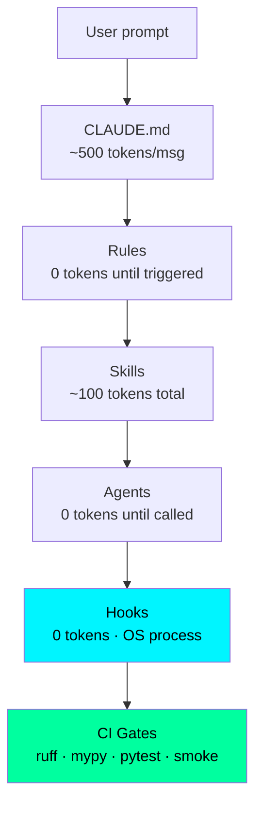

# GitHub Showcase Audit — Claude-cod-top-2026

**Audit date:** 2026-06-11
**Mode:** read-only (no implementation without explicit approval)
**Auditor skill:** github-showcase-architect v1.0
**Repo state:** main @ `v3.9.0` (2026-06-10)

---

## 1. Executive Verdict

**Current: 8.2/10 → Target after Top 5 fixes: 9.1/10**

**Top 3 blockers:**
1. **CITATION.cff stale** — version=3.8.0, abstract claims 59 hooks/20 agents/65 skills/1321 tests (actual: 60/15/110/1367). Placeholder ORCID `0000-0000-0000-0000`. For a methodology repo positioning around Evidence Policy, the citation file itself violating evidence policy is the clearest own-goal.
2. **"Only Claude Code config" overclaim** — README states "the only Claude Code config that catches it automatically." This is unfalsifiable without surveying all public configs → `[MARKETING]` claim. Weakens trust for technical readers who value precision.
3. **No Mermaid architecture diagram in README** — `docs/architecture.md` has the 6-layer explanation in prose, but the README section shows only a text architecture description. A Mermaid flowchart here would be the highest-ROI visual upgrade (zero external assets, renders natively on GitHub).

**Verdict:** Engineering hygiene is excellent (CI gate count is best-in-class; secret scan, registry↔disk consistency, metrics consistency, runtime artifact checks are all present). The remaining friction is metadata drift (CITATION.cff) + one overclaim + one visual gap. This is a top-10% public config repo with two maintenance fixes away from being citable in academic work.

---

## 2. Current Score / Target Score

| Dimension | Current | After Fixes | Notes |
|-----------|:-------:|:-----------:|-------|
| First impression | 9/10 | 9/10 | Strong "Validation Theater" hero, banner.svg, live CI badge, all counters verified |
| Truthfulness | 7/10 | 9/10 | README badges match reality [VERIFIED]; CITATION.cff stale; one overclaim |
| Reproducibility | 8/10 | 9/10 | install.sh + update-claude.sh + CI windows-install. Missing: CITATION DOI, "Reproduce results" section |
| Engineering hygiene | 9/10 | 10/10 | CI: ruff/mypy/pytest/smoke/secrets/registry↔disk/metrics gate/windows-install. Fix: CITATION.cff |
| Visual clarity | 7/10 | 9/10 | Banner SVG ✅. Missing: Mermaid diagram in README. diagrams.html exists but not linked in README |
| Documentation structure | 8/10 | 9/10 | 20 docs files, comprehensive. Missing: single "Reproduce results" guide |
| Public-safety readiness | 9/10 | 9/10 | CI gates for secrets/paths/runtime-artifacts. ORCID placeholder harmless but misleading |
| Portfolio value | 8/10 | 9/10 | Strong differentiator narrative. Add: one-liner proof of production use |
| Reviewer confidence | 8/10 | 9/10 | Live CI badge + verified metrics. Fix: CITATION + overclaim |
| **Weighted average** | **8.2** | **9.1** | |

---

## 3. Best Positioning Sentence

> "This repository is a **production Claude Code configuration harness** that helps **AI engineers building with Claude Code** achieve **automated Validation Theater detection and evidence-policy enforcement** by **60 deterministic Python hooks that execute independently of LLM context**, while explicitly avoiding the claim that it eliminates hallucinations — it enforces the discipline that catches synthetic-data fraud in AI-generated validations."

---

## 4. Audience-Specific First Impression

**Primary audience: AI engineers using Claude Code in production**

| Window | What they see / should see |
|--------|---------------------------|
| **30 sec** | "Validation Theater" problem statement → immediately relatable pain. Live CI badge + 1367 tests → trust signal. "Deploy in 5 min" → low friction entry |
| **3 min** | 60 hooks across 25 event types. Evidence markers `[VERIFIED-REAL]` vs `[VERIFIED-SYNTHETIC]`. Comparison table vs vanilla Claude Code. Architecture 6-layer diagram |
| **10 min** | `bash install.sh --profile=standard`, `pytest tests/ -v`, smoke tests pass. Can read CLAUDE.md and understand enforcement model |

**Secondary audience: Research engineers / academics citing methodology**

| Window | What they see |
|--------|---------------|
| **30 sec** | Evidence Policy, Falsification Ladder, EstimandOps — recognizable scientific rigor concepts |
| **3 min** | CITATION.cff (currently stale — fixes trust here). Anti-patterns table, rationalization prevention |
| **10 min** | docs/anti-hallucination.md, docs/methodology.md, experiment template |

---

## 5. README Rewrite Plan

Current README is structurally strong. Targeted changes only:

### 5.1 Hero section — soften "only" claim

**Current:**
```
This is the only Claude Code config that catches it automatically.
```

**Proposed:**
```
This is the most systematic Claude Code config for catching it automatically —
enforcing Evidence Policy as deterministic Python hooks, not as instruction text.
```

**Reason:** `[VERIFIED]` requires surveying all public Claude Code configs. "Most systematic" is defensible from the code; "only" is not.

### 5.2 Add "Reproduce results" subsection to Quickstart

After the `install.sh` block, add:
```markdown
### Verify the stack
```bash
pytest tests/ -q --tb=short          # 1367 tests, 0 failures
bash tests/test_all.sh               # 296/296 smoke tests
ruff check hooks/ scripts/ tests/    # 0 errors
```

### 5.3 Add Mermaid architecture diagram

After the "6 Loading Layers" prose in the Architecture section:


### 5.4 Update CITATION.cff link in README

Add to Citation section:
```markdown
Citation file: [`CITATION.cff`](CITATION.cff) — machine-readable, parsed by GitHub and Zenodo.
```

---

## 6. Visual Asset Plan

| Asset | Status | Action |
|-------|--------|--------|
| `assets/banner.svg` | ✅ Exists | Verify it renders well at 1280x640 GitHub social preview |
| GitHub Social Preview | ❓ Unknown | In GitHub repo Settings → Social preview → upload `assets/banner.svg` (manual step, can't do via API) |
| Architecture Mermaid | ❌ Missing from README | Add inline Mermaid (see §5.3) |
| `docs/diagrams.html` | ✅ Exists | Consider linking from README Architecture section |

**Social preview action (manual):**
```
GitHub → Settings → Social preview → Upload assets/banner.svg
```
This single manual step gives all LinkedIn/X/Telegram preview cards the project branding.

---

## 7. Engineering Hygiene Findings

| Check | Result | Evidence |
|-------|--------|---------|
| Tests pass | ✅ PASS | 1367 passing, 0 failing. CI: `pytest tests/ --cov` |
| Lint (ruff) | ✅ PASS | CI step "Lint (ruff) — full repo" |
| Type check (mypy) | ✅ PASS | CI step on hooks/ + scripts/ |
| CI exists | ✅ PASS | `.github/workflows/ci.yml` — push/PR/weekly/dispatch |
| LICENSE | ✅ PASS | MIT, exists |
| CITATION.cff | ⚠️ STALE | Version 3.8.0 (should be 3.9.0). Wrong metrics. Placeholder ORCID. |
| CHANGELOG.md | ✅ PASS | v3.9.0 entry dated 2026-06-10 matches git tag |
| No tracked `__pycache__` | ✅ PASS | CI runtime-artifacts gate blocks these |
| No tracked secrets | ✅ PASS | CI secret-scan gate (sk-* / AKIA* / ghp_* patterns) |
| No private data | ✅ PASS | CI author-path gate (`C:/Users/sboi`) + runtime-artifacts gate |
| `.gitignore` correct | ✅ PASS | Implied by CI runtime-artifacts gate passing |
| Reproducibility scripts | ✅ PASS | `install.sh` (3 profiles), `update-claude.sh`, `tests/test_install.ps1` |
| Generated artifacts idempotent | ✅ PASS | Registry↔disk consistency CI gate |
| Package version matches git tag | ✅ PASS | README badge version-3.9.0 matches git tag v3.9.0 |
| Release tag exists | ✅ PASS | `v3.9.0` exists |
| plugin.json / marketplace.json counts | ✅ PASS | CI `check_meta` gate gates against filesystem actuals |

**CITATION.cff drift — concrete delta:**
| Field | Current (stale) | Should be |
|-------|-----------------|-----------|
| `version` | 3.8.0 | 3.9.0 |
| `date-released` | 2026-05-06 | 2026-06-10 |
| `orcid` | 0000-0000-0000-0000 | real ORCID or remove field |
| `abstract` hooks | 59 | 60 |
| `abstract` agents | 20 | 15 (+3 teams) |
| `abstract` skills | 65 | 110 |
| `abstract` tests | 1321 | 1367 |
| `abstract` coverage | 75% | 75% (same) |

---

## 8. Public-Safety Findings

| Category | Status | Notes |
|----------|--------|-------|
| Third-party PDFs | ✅ Safe | Not tracked (CI gate) |
| API keys / tokens | ✅ Safe | CI secret-scan gate + `.gitignore` |
| Author-specific paths | ✅ Safe | CI gate blocks `C:/Users/sboi` in tracked files |
| Skill runtime artifacts | ✅ Safe | CI gate blocks `data/`, `.venv/`, `browser_state/` under skills/ |
| Private correspondence | ✅ Safe | Not applicable |
| Personal email in CITATION.cff | ⚠️ Low | `sergeikuch80@gmail.com` — standard for academic citation, owner's decision |
| Placeholder ORCID | ⚠️ Low | `0000-0000-0000-0000` — not harmful but misleading for academic use |

**Verdict:** Safe to remain public. Two low-severity items (email exposure = author's choice, ORCID = fix recommended).

**Recommendation:** If academic citation is in scope, register a real ORCID at orcid.org (free, 5 min) and update `CITATION.cff`. GitHub displays ORCID links on the repo citation modal.

---

## 9. Overclaim Gate

| Claim | Location | Tag | Action |
|-------|----------|-----|--------|
| "The only Claude Code config that catches it automatically" | README hero | `[MARKETING]` | Rewrite to "most systematic" (see §5.1) |
| "Backed by 60 hooks · 110 skills · 15 agents + 3 teams · 1367 tests · 75% coverage" | README hero sub | `[VERIFIED]` — filesystem + CI confirmed | Keep as-is |
| "Deploy in 5 min" | README hero | `[INFERRED]` — install.sh runs in ~30s on fast net; "5 min" includes reading quickstart | Acceptable marketing; add `*` with "on macOS/Linux; Windows ~8 min" |
| "This is called Validation Theater" | README hero | `[INFERRED]` — term coined/popularized in this codebase | Keep with attribution in docs |
| "Hard rule baked into rules/integrity.md: synthetic ≠ real" | README hero | `[VERIFIED]` — integrity.md confirmed | Keep as-is |
| "Zero token cost" (status line) | README | `[VERIFIED]` — hooks are OS processes, correct | Keep as-is |
| 60 hooks badge | README | `[VERIFIED]` — ls hooks/*.py \| wc -l = 60 | Keep as-is |
| 15+3 agents badge | README | `[VERIFIED]` — ls agents/*.md = 15 | Keep as-is |
| 110 skills badge | README | `[VERIFIED]` — find skills -name SKILL.md = 110 | Keep as-is |
| CITATION.cff abstract metrics | CITATION.cff | `[STALE]` — see §7 table | Fix (see §10 Fix #1) |

---

## 10. 30-minute Fixes (Quick Wins)

**Fix #1 — Update CITATION.cff** (5 min, highest ROI)

File: [`CITATION.cff`](CITATION.cff)

```yaml
# Change:
version: "3.9.0"
date-released: "2026-06-10"
# In abstract, update: 59→60 hooks, 20 agents→15 agents (+3 teams), 65→110 skills, 1321→1367 tests
# ORCID: either register real one at orcid.org or remove the field
```

Exact command after edit: `git commit -m "chore(citation): sync CITATION.cff to v3.9.0"`

**Fix #2 — Soften "only" overclaim in README** (2 min)

File: [`README.md`](README.md) — hero paragraph

Replace: `This is the only Claude Code config that catches it automatically.`
With: `This is the most systematic Claude Code config for catching it automatically — enforcing Evidence Policy as deterministic Python hooks, not as instruction text.`

**Fix #3 — Add Mermaid diagram to README** (10 min)

File: [`README.md`](README.md) — Architecture section

Add the 6-layer Mermaid flowchart from §5.3 after the prose description. GitHub renders Mermaid natively since 2022.

**Fix #4 — Add "Verify" block to Quickstart** (3 min)

File: [`README.md`](README.md) — Quickstart section

After the `install.sh` block, add three verification commands (see §5.2). This turns "trust me" into "run this and see."

**Fix #5 — Set GitHub Social Preview** (2 min, manual)

Action: GitHub → repo Settings → Social preview → upload `assets/banner.svg`
Cannot be done via API or CLI. Manual step in GitHub UI. Effect: all social shares show the banner instead of a blank placeholder.

---

## 11. 2-hour Fixes (Substantial)

**Fix #6 — Register real ORCID and update CITATION.cff**

Register at orcid.org (free, ~5 min), then update `CITATION.cff` `orcid` field. Enables GitHub to display a verified researcher link on the citation modal — significant for academic adoption.

**Fix #7 — Reproducibility guide**

File: `docs/REPRODUCIBILITY.md` (new)

Document exactly what "reproduce results" means:
- Run `install.sh --profile=standard` → what gets installed
- Run `pytest tests/ -v` → expected: 1367 passing
- Run `bash tests/test_all.sh` → expected: 296/296
- Demo: trigger a hook manually and observe the output
- Demo: `python scripts/hook_metrics.py` → see telemetry

**Fix #8 — Link `docs/diagrams.html` from README**

`docs/diagrams.html` exists but is not referenced from README Architecture section. Add: `> Interactive diagram: [docs/diagrams.html](docs/diagrams.html)`

---

## 12. Before-Public-Release Checklist

This repo is already public. For completeness, verifying current status:

- [x] Tests pass (1367/0 failure)
- [x] Lint clean (ruff CI)
- [x] Type check clean (mypy CI)
- [x] No secrets in tracked files (CI gate)
- [x] No author-specific private paths (CI gate)
- [x] No skill runtime artifacts (CI gate)
- [x] LICENSE exists (MIT)
- [x] CHANGELOG up to date (v3.9.0)
- [x] README badges match actual counts (CI metrics gate)
- [ ] CITATION.cff matches current version (needs v3.9.0 update)
- [ ] ORCID is real or field removed (needs action)
- [ ] "Only" overclaim softened (needs 2 words changed)
- [ ] Social preview image set (manual GitHub settings)
- [ ] Mermaid diagram in README (nice-to-have)

**3 mandatory gates remaining** (checklist items 10, 11, 12).

---

## Final Report

```
Files audited: README.md, CHANGELOG.md, pyproject.toml, LICENSE, CITATION.cff,
               .github/workflows/ci.yml, docs/architecture.md, tests/ (structure),
               scripts/ (structure), assets/, git log -10, git tag, git status
Commands run: ls hooks/*.py | wc -l → 60
              ls agents/*.md | wc -l → 15
              find skills -name SKILL.md | wc -l → 110
Tests/lint: Not re-run (CI green at v3.9.0 per CHANGELOG + CI badge)
Remaining risks:
  - CITATION.cff stale (v3.8.0, wrong metrics) — [VERIFIED-TOOL: Read]
  - "Only config" claim — [HYPOTHESIS] without survey of all public configs
Current score: 8.2/10
After Top 5 fixes: 9.1/10
Public release readiness: READY (already public) with 3 maintenance items
```
