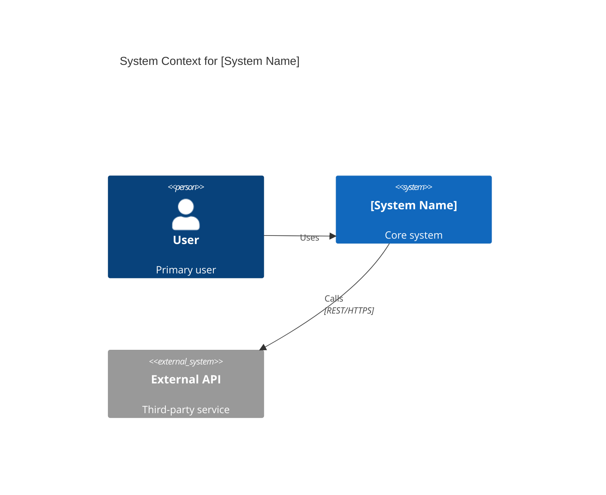
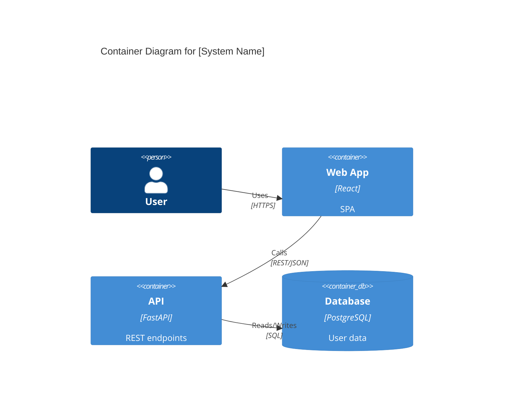
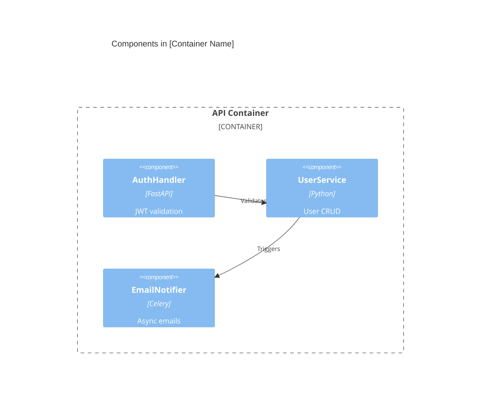

<!-- BSV — Brief Skill View | поиск: BSV
Скил   : c4-architecture
TL;DR  : 4-уровневая архитектурная документация с Mermaid диаграммами (C4 Model)
Вызов  : /c4-architecture, /c4, c4 model, architecture diagram
НЕ для : Архитектурные решения (→ /architect); код review (→ /reviewer)
-->

# C4 Architecture — 4-Level Documentation

## Зачем C4

Одна диаграмма не может показать всё. C4 Model (Simon Brown) решает это:
- **Non-technical stakeholders** видят только Level 1 (Context)
- **Architects** работают с Level 2-3 (Container + Component)
- **Developers** используют Level 4 (Code)

Каждый уровень — зум в предыдущий. Никакого информационного перегруза.

---

## Level 1 — Context Diagram

**Аудитория:** CEO, product managers, external partners — все кто не знает internals.

**Что показывает:** Система как чёрный ящик + кто её использует + с чем она интегрируется.

**Шаблон:**
```markdown
# System Context: [System Name]

## System Overview
[1-2 предложения — что делает система для кого]

## Users & Personas
| Persona | Role | Key Actions |
|---------|------|-------------|
| [Human user] | [Role] | [What they do] |
| [External system] | [Integration] | [API/data flow] |

## External Dependencies
| System | Direction | Protocol | Purpose |
|--------|-----------|----------|---------|
| [Name] | outbound | REST | [Why] |

## User Journeys
### [Feature]: [Persona] Flow
1. [Step 1]
2. [Step 2]
```

**Mermaid диаграмма:**


---

## Level 2 — Container Diagram

**Аудитория:** Software architects, senior developers.

**Что показывает:** Deployable units (services, databases, frontends) и их связи.

**Шаблон:**
```markdown
# Container Diagram: [System Name]

## Containers
| Container | Tech | Responsibility |
|-----------|------|----------------|
| Web App | React + TS | UI layer |
| API Server | FastAPI | Business logic |
| Database | PostgreSQL | Persistence |
| Cache | Redis | Session + rate limit |

## Data Flows
| From | To | Protocol | Data |
|------|----|----------|------|
| Web App | API | HTTPS/REST | User requests |
| API | DB | TCP | Queries |
```

**Mermaid диаграмма:**


---

## Level 3 — Component Diagram

**Аудитория:** Software developers в команде.

**Что показывает:** Компоненты внутри одного контейнера (модули, слои, сервисы).

**Шаблон:**
```markdown
# Component Diagram: [Container Name]

## Components
| Component | Responsibility | Interface |
|-----------|----------------|-----------|
| AuthHandler | JWT validation | FastAPI dependency |
| UserService | User CRUD | Domain service |
| EmailNotifier | Send emails | Async worker |

## Dependencies
[AuthHandler] → [UserService]: validates user
[UserService] → [EmailNotifier]: triggers on registration
```

**Mermaid диаграмма:**


---

## Level 4 — Code Level

**Аудитория:** Developers реализующие конкретный компонент.

**Что показывает:** Классы, функции, key algorithms — только самое важное, не весь код.

```markdown
# Code Level: [Component Name]

## Key Classes / Functions
| Name | Type | Responsibility |
|------|------|----------------|
| `AuthHandler.verify_token()` | method | JWT decode + validate |
| `UserService.create_user()` | method | User creation + email trigger |

## Critical Algorithms
[Только если non-obvious: rate limiting logic, caching strategy, etc.]

## Non-Obvious Decisions
[Причины важных implementation choices — для future developers]
```

---

## Workflow: Документировать Проект

```
Шаг 1: Читай существующий код (CLAUDE.md, main files, README)
Шаг 2: Level 1 → найди users + external systems
Шаг 3: Level 2 → найди deployable units из docker-compose / infra files
Шаг 4: Level 3 → для ключевых containers разбери modules
Шаг 5: Level 4 → только для complex/critical components
Шаг 6: Сохрани в docs/architecture/ (один файл на уровень)
```

**Правило:** Начни с Level 1. Углубляйся только если стейкхолдер просит детали.

---

## Связанные скилы

- `architect` — принимает архитектурные решения (C4 документирует их)
- `conductor` — context артефакты проекта (tech-stack.md дополняет C4)
- `reviewer` — architectural review используя C4 как baseline
