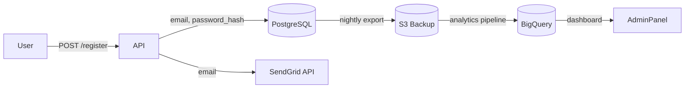

<!-- BSV
Скил   : data-breach-blast-radius
TL;DR  : 7-шаговый аудит: инвентарь PII → трассировка потоков → расчёт штрафов → roadmap
Вызов  : /data-breach-blast-radius, breach impact, blast radius analysis
НЕ для : Live incident response (используй incident-response скил), юридических заключений
-->

# Data Breach Blast Radius Analyzer

Proactive blast radius analysis **before** any breach occurs. Audits sensitive data handling, traces data flows, identifies exposure vectors, and quantifies regulatory consequences using law-sourced penalty formulas.

> This skill does not replace qualified legal counsel or formal DPIAs. Use for risk planning and breach readiness only.

---

## When to Use This Skill

- Breach impact assessment and worst-case scenario planning
- Sensitive data inventory for a codebase or architecture
- Data flow security audits before launch
- Pre-breach readiness review (security design reviews, SOC 2 prep)
- Regulatory fine estimation for GDPR / CCPA / HIPAA scope

---

## Seven-Step Execution Workflow

### Step 1 — Scope & Stack Detection

Identify the analysis boundary, then enumerate:
- Languages, frameworks, ORMs (Django, SQLAlchemy, Prisma, etc.)
- Databases and caches (PostgreSQL, Redis, S3, BigQuery)
- External APIs (Stripe, Twilio, SendGrid, analytics SDKs)
- Infrastructure-as-code (Terraform, Helm, CloudFormation)
- Deployment environment (cloud region affects jurisdiction)

Output: **Stack Summary Table** with data handling surface.

---

### Step 2 — Sensitive Data Inventory

Scan models, API schemas, config files, and logging layers. Classify every sensitive field:

```
Search targets:
  - ORM model definitions (models.py, schema.prisma, *.entity.ts)
  - API request/response types (serializers, DTOs, OpenAPI specs)
  - Log statements (grep for: email, ssn, dob, card, password, token)
  - Config/env templates (.env.example, config.yaml)
  - Migration files (ALTER TABLE, ADD COLUMN)
```

| Field | Classification | Tier | Cardinality Est. | Regulation |
|-------|---------------|------|-----------------|------------|
| `user.email` | PII | T3 | = user count | GDPR, CCPA |
| `user.ssn` | PII-sensitive | T1 | = user count | GDPR, CCPA, HIPAA |
| `payment.card_number` | Financial | T2 | = transaction count | PCI-DSS |
| `health.diagnosis` | PHI | T1 | = patient count | HIPAA |
| `session.token` | Credential | T1 | = active sessions | all |

---

### Step 3 — Data Flow Tracing

Document all paths where sensitive data travels:

```
Ingestion   → [Forms, APIs, Webhooks, File uploads, OAuth callbacks]
Processing  → [Caching layers, Background queues, ML pipelines, ETL jobs]
Storage     → [Primary DB, Read replicas, Backups, Data warehouse, Logs]
Transmission→ [Third-party APIs, Email providers, Analytics, CDN logs]
Exposure    → [Error pages, Debug endpoints, Export features, Admin panels]
```

Produce a Mermaid data flow diagram:



---

### Step 4 — Blast Radius Calculation

Score each exposure vector:

```
Blast Score = Data_Sensitivity × Exposure_Likelihood × Population_Scale × Data_Completeness
```

**Sensitivity Tier Multipliers:**

| Tier | Category | Examples | Multiplier |
|------|----------|----------|------------|
| T1 | Catastrophic | Biometrics, health records, financial credentials, SSN | ×5 |
| T2 | Critical | Name + DOB + address, card data, passport numbers | ×4 |
| T3 | High | Email + hashed password, phone, geolocation, IP | ×3 |
| T4 | Elevated | First name only, email-only, city-level location | ×2 |
| T5 | Standard | Non-personal config, public content, anonymized data | ×1 |

**Jurisdiction multipliers** (applied on top of tier score):
- Records include minors (under 18): ×2
- Health data present: ×3
- Financial credentials present: ×5

**Exposure Likelihood** (0.0–1.0):
- Public endpoint, no auth: 0.9
- Auth-required, known CVE: 0.6
- Auth-required, no known CVE: 0.3
- Internal-only, network-isolated: 0.1

**Example calculation:**
```
Exposed: 50,000 user emails + hashed passwords (T3)
Likelihood: 0.6 (auth-required, known SQLi vector in legacy endpoint)
Population scale: 50,000 / 1,000,000 = 0.05 (small fraction of max)
Data completeness: 0.7 (email + hash, no DOB/SSN)

Score = 3 × 0.6 × 0.05 × 0.7 = 0.063  → LOW-MEDIUM
```

---

### Step 5 — Regulatory Impact Estimation

Calculate per-jurisdiction exposure. **Figures are law-sourced; estimates are heuristic.**

#### GDPR (Art. 83) — EU residents affected
```
Tier A violation (severe): up to €20M or 4% global annual turnover, whichever higher
Tier B violation (moderate): up to €10M or 2% global annual turnover

Realistic fine range = affected_EU_records × €100–€400 per record (IBM benchmark)
Notification deadline: 72 hours to supervisory authority
```

#### CCPA § 1798.155 — California residents affected
```
Intentional violation: $7,500 per affected consumer
Unintentional violation: $2,500 per affected consumer (30-day cure period)

Example: 10,000 CA residents × $2,500 = $25,000,000 max
```

#### HIPAA 45 CFR § 160.404 — PHI affected
```
Unknowing violation:    $100 – $50,000 per violation
Reasonable cause:       $1,000 – $50,000 per violation
Willful neglect (fixed): $10,000 – $50,000 per violation
Willful neglect (unfixed): $50,000 per violation

Annual cap per category: $1,800,000
Notification: individuals within 60 days; HHS within 60 days; media if >500 in a state
```

#### Non-penalty costs (IBM Cost of a Data Breach 2024)
```
Average total cost per breach:   $4.88M (global), $9.36M (US)
Detection + escalation:          $1.58M
Notification:                    $0.37M
Post-breach response:            $1.68M
Lost business (churn, reputation): $1.47M
Cost per record:                 $165 average; $429 for healthcare
```

---

### Step 6 — Blast Radius Report

Generate the following sections in order:

1. **Executive Summary** — 3-bullet risk headline, total max regulatory exposure (€/$), top 1 vector
2. **Sensitive Data Inventory** — table from Step 2
3. **Data Flow Diagram** — Mermaid rendered visually
4. **Top 5 Exposure Vectors** — ranked by blast score, with file:line citations
5. **Regulatory Blast Radius Table** — per-jurisdiction fines (max + realistic)
6. **Financial Impact Estimate** — total including non-penalty costs
7. **Hardening Roadmap** — prioritized by impact-per-effort

---

### Step 7 — Hardening Roadmap

Prioritize fixes by: `Impact_Score / Effort_Days`. Mark quick wins (< 1 day).

| Priority | Finding | Impact | Effort | Fix |
|----------|---------|--------|--------|-----|
| P0 🔴 | SSN stored plaintext in `users.ssn` | Critical | 0.5d | Encrypt at rest (AES-256) + mask in logs |
| P1 🔴 | `/admin/export` returns full PII, no rate limit | High | 1d | Add field allowlist + rate limit |
| P2 🟡 | Email logged in `auth.log` at DEBUG level | Medium | 0.5d | Replace with user_id in log statements |
| P3 🟡 | S3 backup bucket has public-read ACL | High | 0.5d | Set bucket to private, enable versioning |
| P4 🟢 | No data retention policy enforced | Medium | 3d | Add scheduled deletion job + policy doc |

---

## Output Rules

- Distinguish law-sourced figures (mark `[LAW-SOURCED: Art. 83 GDPR]`) from heuristic estimates (mark `[HEURISTIC: IBM 2024]`)
- Cite specific file paths and line numbers for every finding
- State all assumptions explicitly, especially record count estimates
- Never auto-apply code changes — present findings for human review
- If scope is ambiguous, ask: "Should I analyze the entire codebase or a specific service?"

---

## Quick Start Prompts

```
/data-breach-blast-radius analyze src/users/ — focus on PII handling
/data-breach-blast-radius worst case for EU users if our DB is exfiltrated
/data-breach-blast-radius what GDPR fines do we face if auth service is breached?
/data-breach-blast-radius full audit of this Django project
```
