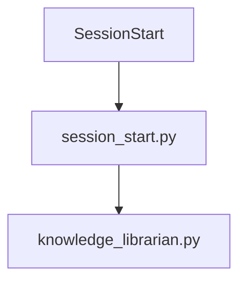
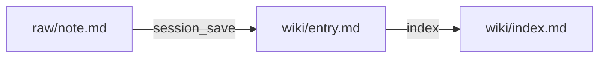
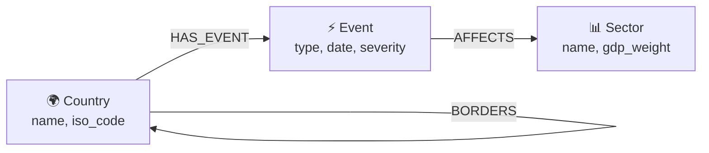

# Diagram Generator

## Что умеет
Превращает код, описание архитектуры или структуру данных в читаемую диаграмму.
Особенно полезно для:
- Neo4j графов (nodes → edges → properties)
- Архитектуры микросервисов (кто кому звонит)
- Потоков данных (откуда данные, куда идут)
- Схем БД (таблицы, связи, foreign keys)
- Хуков и пайплайнов (SessionStart → Stop lifecycle)

## Шаг 1: Прочитай контекст сам
```
!`cat .claude/memory/activeContext.md 2>/dev/null | head -40`
!`ls src/ 2>/dev/null | head -20`
```
Определи: что визуализировать, какой формат нужен.

## Шаг 2: Выбери формат

**Mermaid** — если будет в README.md или Obsidian:


**ASCII** — если нужно в терминале или комментарии к коду:
```
SessionStart
  ├── session_start.py   → activeContext + decisions
  └── knowledge_librarian.py → wiki + patterns
```

**Flowchart** для процессов:


## Шаг 3: Правила хорошей диаграммы

- **Одна диаграмма = одна идея** — не пытайся показать всё сразу
- **Направление слева направо** (LR) для потоков, сверху вниз (TD) для иерархий
- **Максимум 7-10 узлов** — больше = нечитаемо
- **Подписи на рёбрах** — что передаётся между узлами
- **Группировка** — связанные элементы в subgraph

## Шаг 4: Neo4j специфика

Для граф-схем используй:


Temporal properties показывай отдельно:
```
Node: Event
  Properties:
    - valid_from: datetime
    - valid_to: datetime | null
    - confidence: float [0..1]
    - source: string
```

## Gotchas
- Mermaid не рендерится в GitHub если нет тройных backtick с "mermaid"
- ASCII диаграммы теряются при compaction — сохраняй Mermaid в файл
- Для Obsidian: Mermaid рендерится нативно, можно использовать graph, flowchart, sequenceDiagram
