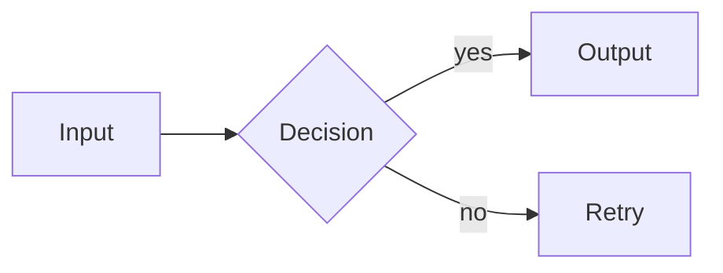

# Obsidian Markdown — Syntax Reference

## Wikilinks & Embeds

```markdown
[[Note Title]]                    # link to note
[[Note Title|display text]]       # aliased link
[[Note Title#Heading]]            # link to heading
![[Note Title]]                   # embed note inline
![[image.png|400]]                # embed image with width
![[Note Title#^block-id]]         # embed specific block
```

## Callouts (Admonitions)

```markdown
> [!NOTE]
> Standard note callout

> [!WARNING] Custom Title
> Warning with custom header

> [!TIP]+ Collapsible (open)
> Expanded by default

> [!DANGER]- Collapsible (closed)
> Collapsed by default
```

Types: `NOTE` `TIP` `WARNING` `DANGER` `INFO` `SUCCESS` `QUESTION` `FAILURE` `BUG` `EXAMPLE` `QUOTE` `ABSTRACT`

## Frontmatter / Properties

```yaml
---
title: My Note
tags: [python, backend]
created: 2026-04-12
status: draft
aliases: [My Note Alias]
---
```

Access in Dataview: `this.file.frontmatter.status`

## Block References

```markdown
Some paragraph content. ^my-block-id

# Elsewhere — reference it:
![[Note Title#^my-block-id]]
```

## Dataview Queries

```dataview
TABLE file.ctime AS "Created", status
FROM #python
WHERE status = "draft"
SORT file.ctime DESC
```

```dataview
LIST
FROM "projects/"
WHERE contains(tags, "active")
```

Inline: `= this.file.name` or `= [[Other Note]].status`

## Mermaid Diagrams

````markdown

````

## Templater (community plugin)

```markdown
<% tp.date.now("YYYY-MM-DD") %>
<% tp.file.title %>
<% tp.user.my_function() %>
```

## Search Operators

```
file:("exact name")       # by filename
path:projects/            # by path
tag:#python               # by tag
line:("exact text")       # by content
section:("## Heading")    # by section
```

## Tips
- `Ctrl+K` — insert link
- `Ctrl+E` — toggle edit/preview
- `Alt+Enter` — follow wikilink
- `Ctrl+Shift+F` — global search
